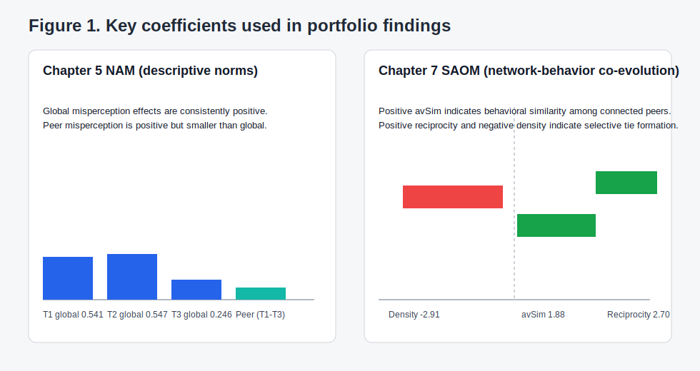

# Findings Summary

Reference index: [`reproduced/docs/README.md`](../README.md)

## Norm Misperceptions and Drinking Behaviour (Chapter 5)

A Network Autocorrelation Model (NAM) is a regression that adjusts for dependence between connected people, so estimates are not treated as if each student were independent.

Students consistently overestimated how much the typical resident drinks — by 1.5–1.7 AUDIT-C points across all waves. Peer-level misperception (how much their nominated friends drink) hovered near zero. The pipeline reproduces the thesis NAM coefficients showing how these misperceptions relate to personal consumption:

| Time period | Global misperception β | Peer misperception β |
|---|---|---|
| Time 1 (Oct 2022) | 0.541 (p<0.001) | 0.045 (n.s.) |
| Time 2 (Mar 2023) | 0.547 (p<0.001) | 0.124 (p<0.05) |
| Time 3 (Oct 2023) | 0.246 (p<0.01) | 0.192 (p<0.01) |

The pattern is a referent shift. Early in the year, overestimating the broader community's drinking is the dominant predictor. By year-end, local peer-level misperception gains significance as students form stable friendship clusters and recalibrate who they compare themselves to.

For intervention design, this supports a dual strategy: broad norm-correction messaging (targeting the global misperception that dominates early) combined with network-aware seeding where local clusters sustain misperceptions later in the year.

Chapter 6 extends this to injunctive norms — perceived approval of risky drinking. Overestimation of peer approval was prevalent but did not significantly predict consumption. The thesis title for this chapter is direct: injunctive norm misperception "does not drive drinking behaviours."

## Social Influence Without Social Selection (Chapter 7)

A Stochastic Actor-Oriented Model (SAOM) jointly models network tie change and behaviour change over time, separating two mechanisms that observational data normally confounds: social selection (do similar drinkers become friends?) and social influence (do friends become similar drinkers?).

The answer is unambiguous in this cohort:

| Effect | β | SE | p | Interpretation |
|---|---|---|---|---|
| Average similarity (influence) | 1.88 | 0.68 | <0.01 | Students were 17% more likely to adjust drinking one unit closer to friends' average (OR=1.17, 95% CI: 1.05–1.31) |
| AUDIT-C similarity (selection) | −0.08 | 0.53 | 0.88 | Drinking habits did not predict friendship formation |
| Reciprocity | 2.70 | 0.31 | <0.001 | Mutual ties strongly preferred |
| Transitive triplets | 0.78 | 0.12 | <0.001 | Friends-of-friends become friends |
| Flatmate proximity | 0.76 | 0.23 | <0.001 | Living together drives tie formation |
| Blockmate proximity | 0.80 | 0.22 | <0.001 | Shared block drives tie formation |
| Density | −2.91 | 0.52 | <0.001 | Network is sparse and selective |

Peer influence is operating, but in a selective social graph — not random mixing. Friendship formation is driven by reciprocity, transitivity, and residential proximity. Strategy should not assume a fully connected population; behaviour change propagates through specific reciprocal clusters.

## Annotated Visual

*Figure 1. Left: Chapter 5 NAM coefficients across three time periods. Global misperception (solid) dominates early but weakens; peer misperception (dashed) gains significance by Time 3. Right: Chapter 7 SAOM coefficients. The positive average similarity effect (β=1.88) indicates peer influence on drinking; non-significant selection effects confirm that drinking habits do not drive friendship formation. Structural effects (reciprocity, transitivity, proximity) shape the network within which influence operates.*

## Caveats

- Behaviour goodness-of-fit is poor (p<0.001 across all periods), largely because the SAOM cannot capture the bimodal AUDIT-C distribution — non-drinkers (score 0) behave differently from the continuous-drinking majority.
- Network measurement began one month after arrival. Early preferential attachment dynamics may have already resolved by Wave 2. The negative indegree popularity effect (β=−0.32, p=0.09) may be an artefact of this timing.
- Single residence hall in South Yorkshire (255 of 375 invited, 68% response rate; 87% retention across 6 waves). UK binge-drinking rates (80% monthly at the October peak) far exceed comparable US cohorts, limiting cross-cultural generalisability.
- Self-reported alcohol data introduce possible social-desirability and recall bias despite confidentiality and pseudonymisation controls.
